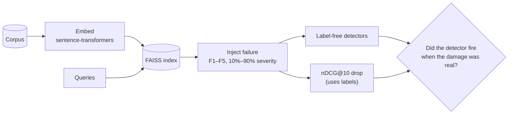

<div align="center">

# Silent Failures

**Detecting retrieval degradation in RAG systems without relevance labels**


[Motivation](#motivation) · [Approach](#approach) · [Failures](#failure-families) · [Detectors](#detectors) · [Evaluation](#evaluation) · [Early results](#early-results) · [Timeline](#timeline)

</div>

## Motivation

A RAG system embeds the user's question, finds the most similar documents in a vector index, and passes them to an LLM along with the question. If the retrieval step gets worse, nothing errors out. The system stays up and latency looks normal, but the answers get worse, and usually nobody notices for a while.

A few ways this happens in practice:

- an embedding model gets upgraded, but only part of the corpus is re-embedded
- outdated documents stay in the index next to their replacements
- chunking or preprocessing settings change partway through the corpus
- users start asking about things the corpus doesn't cover

Production systems don't have relevance labels, so you can't just track nDCG. Teams rely on label-free signals instead, like drift statistics or retrieval scores, and it isn't clear which of these actually catch real damage. That is the question this project tries to answer.

**What we plan to release**

1. An open-source benchmark that injects realistic retrieval failures at controlled severity
2. A detector-by-failure heatmap showing which signal catches what, and how early
3. A short, practical guide to monitoring retrieval quality

## Approach

We build a standard retrieval pipeline, break it in controlled ways, and check whether each detector notices. The detectors only get what a production system would have: queries, embeddings and similarity scores. The labeled relevance judgments are used for one thing only, measuring how much damage each failure actually caused.



## Failure families

Each failure is applied at increasing severity, from 10% up to 90% of the corpus or query traffic.

| ID | Failure | How we simulate it |
|---|---|---|
| F1 | Partial embedding upgrade | Mix vectors from two same-dimension models in one index |
| F2 | Stale documents | Outdated content from HoH, plus injected distractors |
| F3 | Chunking change | Re-chunk only part of the corpus |
| F4 | Query shift | Move query traffic toward topics outside the corpus |
| F5 | Config mismatch | Drop the query prefix, turn off vector normalization, etc. |

We also run three **harmless** changes. A good detector should stay quiet on these, so they tell us its false-alarm rate.

## Detectors

| Family | Detectors |
|---|---|
| Drift statistics (ML) | PSI, Kolmogorov–Smirnov test, MMD, domain classifier |
| Query performance prediction (IR) | Score-based signals, canary queries |
| Other | Re-embedding check, LLM-as-judge |

If there's time, we'll also test whether an agentic retriever that searches more than usual is itself a sign of hidden damage.

## Evaluation

The ground truth is the drop in **nDCG@10** from the clean baseline. Each check runs on a sampled window of queries, repeated over many trials per condition. A condition counts as harmful when its drop is significant under a paired bootstrap test.

Each detector is scored on:

- **Accuracy**: AUROC for separating harmful conditions from clean and harmless ones
- **Earliness**: the lowest severity at which it fires, at a 5% false-alarm rate
- **False alarms**: how often its default threshold fires on the harmless changes
- **Cost**: compute and API cost per check

We'll also report how big an nDCG@10 drop the common "PSI > 0.25" rule of thumb actually corresponds to.

### Datasets

| Dataset | Size | Used for |
|---|---:|---|
| NFCorpus | 3,633 medical documents | Development. All detector tuning happens here |
| SciFact | 5,183 scientific abstracts | Held-out evaluation |
| FiQA | 57,638 financial forum posts | Held-out evaluation |
| MLDR | long documents | Long-document behavior |
| HoH | real outdated content | Source for the stale-document failure (F2) |

SciFact and FiQA are never used for tuning, so the final numbers show how well the detectors generalize to data they haven't seen.

## Early results

Our first pass over SciFact is in [`notebooks/scifact_eda.ipynb`](notebooks/scifact_eda.ipynb). It uses `multi-qa-MiniLM-L6-cos-v1` as a placeholder model.

| | Queries | Documents |
|---|---:|---:|
| Median length (tokens) | 21 | 316 |
| Max length (tokens) | 79 | 1,939 |
| Longer than 512 tokens (the model's hard limit) | 0 | 455 (8.8%) |
| Longer than ~250 tokens (what the model was trained on) | 0 | 3,793 (73.2%) |

Query length is not a concern. Document length is: most abstracts are longer than the inputs this model was trained on. This will shape how we choose the final model and chunking strategy.

As a sanity check on the pipeline, exact cosine search in FAISS over the 300 labeled test queries gives **nDCG@10 = 0.540** (95% bootstrap CI: 0.491–0.588). This isn't our baseline yet, since the model and document handling haven't been fixed.

## Timeline

| Weeks | Milestone | Done when | Status |
|---|---|---|---|
| 1–2 | Baseline pipeline on SciFact, FiQA, NFCorpus | Model and chunking fixed; clean nDCG@10 with CIs | In progress |
| 3–4 | Failure-injection harness (F1–F5 + 3 harmless) | nDCG@10 drops steadily with severity; harmless changes don't | |
| 5–6 | Drift and QPP detectors | Implemented and tuned on NFCorpus | |
| 7 | Canary, re-embedding check, LLM judge | Implemented, with cost per check recorded | |
| 8 | Held-out evaluation | AUROC, earliness and false alarms on SciFact and FiQA; heatmap; PSI analysis | |
| 9–10 | Agentic extension (optional), release | Benchmark, monitoring guide, final report | |

## Repository

```text
notebooks/
  scifact_eda.ipynb   dataset exploration and pilot retrieval check
```

More will be added here as the pipeline, failure injection and detectors come together.

**Stack:** sentence-transformers, FAISS, scikit-learn, SciPy, DuckDB, matplotlib

## Team

Kameswara Sai Srikar Manda, Alekhya Bulusu, Shane Hussey, Ying-Jen Chiang

DS5500 Capstone, Fall 2026, Northeastern University

## References

1. Lewis et al. [Retrieval-Augmented Generation for Knowledge-Intensive NLP Tasks](https://arxiv.org/abs/2005.11401). 2020.
2. Thakur et al. [BEIR: A Heterogeneous Benchmark for Zero-shot Evaluation of Information Retrieval Models](https://arxiv.org/abs/2104.08663). 2021.
3. Chen et al. [M3-Embedding](https://arxiv.org/abs/2402.03216) (source of MLDR). 2024.
4. Ouyang et al. [HoH: A Dynamic Benchmark for Evaluating the Impact of Outdated Information on RAG](https://arxiv.org/abs/2503.04800). 2025.
5. Zheng et al. [Revisiting RAG Retrievers: An Information Theoretic Benchmark](https://arxiv.org/abs/2602.21553). 2026.
6. Garani. [A Systematic Taxonomy of Failure Modes in Retrieval-Augmented Generation Systems](https://aclanthology.org/2026.trustnlp-main.27/). TrustNLP 2026.
7. Reimers and Gurevych. [Sentence-BERT](https://arxiv.org/abs/1908.10084). EMNLP 2019.
